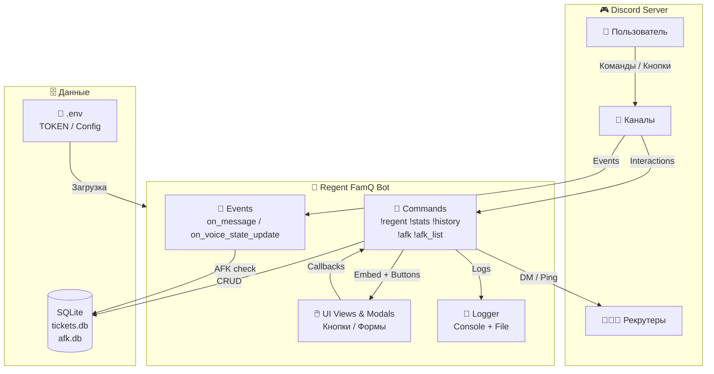
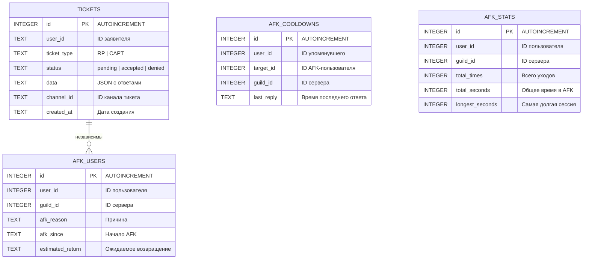
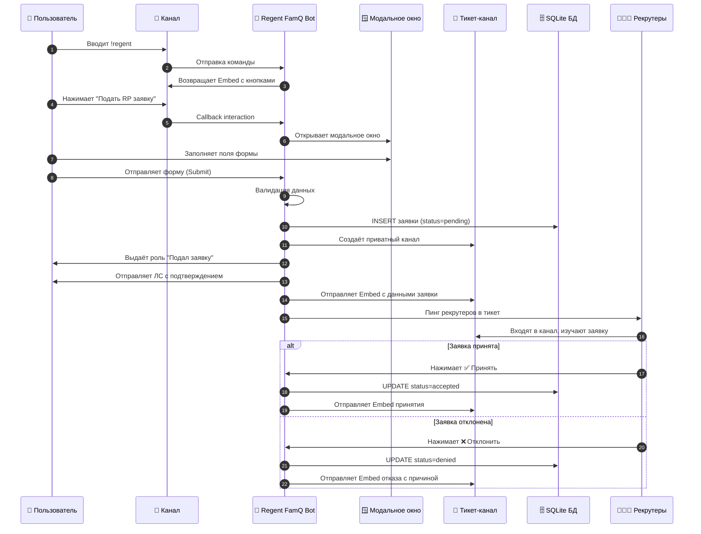
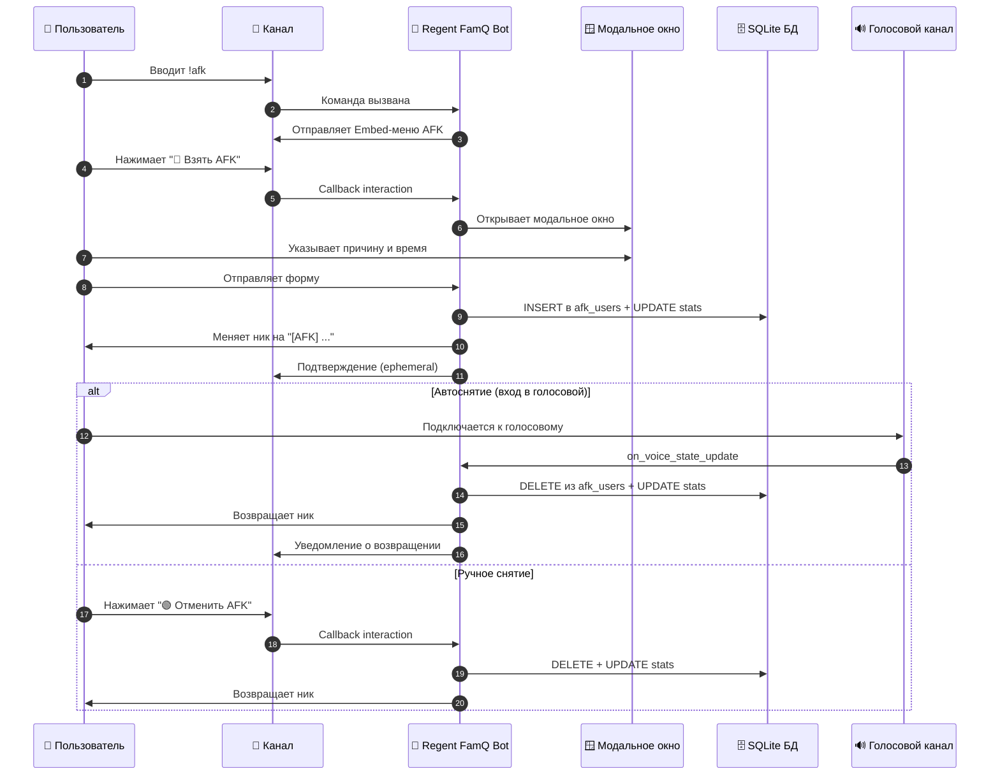

<div align="center">

# 🎫 Regent FamQ Bot

**Discord-бот для автоматизации процессов семей на РП проекте Majestic RP**

[](https://python.org)
[](https://discordpy.readthedocs.io/)
[](./src/app/tests)
[](./LICENSE)

</div>

---

## 📋 Оглавление

- [Описание](#-описание)
- [Возможности](#-возможности)
- [Архитектура](#-архитектура)
- [Бизнес-процессы](#-бизнес-процессы)
- [Быстрый старт](#-быстрый-старт)
- [Конфигурация](#-конфигурация)
- [Команды](#-команды)
- [AFK система](#-afk-система)
- [Docker](#-docker)
- [Структура проекта](#-структура-проекта)
- [Тестирование](#-тестирование)
- [Лицензия](#-лицензия)

---

## 📝 Описание

**Regent FamQ Bot** — комплексный Discord-бот для автоматизации процессов игровой семьи **Regent** на РП проекте **Majestic RP**.

Бот берёт на себя рутину: приём и обработка заявок, управление AFK-статусами, ведение статистики, логирование действий рекрутов. Всё настраивается через `config.py` — без необходимости лезть в исходный код.

---

## ✨ Возможности

| Функция | Описание |
|---------|----------|
| 🎫 **Два типа заявок** | RP (ролевая) и CAPT (каптёрская) с разными формами |
| 🏷️ **Автовыдача ролей** | При подаче заявки выдаётся роль «Подал заявку» |
| 📨 **Уведомления в ЛС** | Подтверждение подачи заявки в личные сообщения |
| 🔒 **Приватные каналы** | Тикеты видят только заявитель, рекруты и администрация |
| 📊 **Статистика** | Команды `!stats` и `!history` для аналитики |
| 🔊 **Вызов на обзвон** | Кнопки для вызова заявителя в голосовые каналы |
| ✅ / ❌ **Принятие/отклонение** | С указанием причины и автоматическим логированием |
| 🔴 **AFK система** | Взятие/снятие AFK с указанием времени возвращения, автоответ при упоминании, статистика |
| 🗄️ **SQLite база данных** | Локальное хранение без внешнего сервера |
| ⚙️ **Полностью настраиваемый** | Все тексты, роли и каналы в `config.py` |
| 🧪 **191 юнит-тест** | Запускаются автоматически перед стартом бота |

---

## 🏗️ Архитектура

### Диаграмма компонентов



### Структура базы данных



---

## 📊 Бизнес-процессы

### 🎫 Подача и обработка заявки



### 🔴 AFK: взятие и снятие



### 📊 Статистика покрытия тестами

| Модуль | Тестов | Покрытие |
|--------|--------|----------|
| `config.py` | 32 | ✅ Конфигурация, тексты, роли |
| `database/` | 10 | ✅ CRUD заявок, статистика |
| `tickets/` | 12 | ✅ Создание, принятие, отказ, обзвон |
| `afk/database` | 25 | ✅ AFK CRUD, кулдауны, статистика |
| `afk/models` | 27 | ✅ Бизнес-логика, никнеймы |
| `afk/commands` | 19 | ✅ Команды !afk, !afk_list, !afk_check, !afk_stats |
| `afk/events` | 11 | ✅ on_message, on_voice_state_update |
| `afk/views` | 42 | ✅ UI, кнопки, модалки, парсинг времени |
| `utils/logger` | 5 | ✅ Логирование, форматтеры |
| **ИТОГО** | **191** | **100% ядерных модулей** |

---

## 🚀 Быстрый старт

### 1. Клонирование

```bash
git clone https://github.com/yyangdev/majestick-famq-discord-bot.git
cd majestick-famq-discord-bot/src/app
```

### 2. Зависимости

```bash
pip install -r requirements.txt
```

### 3. Переменные окружения

```bash
cp .env.example .env
```

Отредактируй `.env`:

```env
TOKEN=Ваш_Токен_От_Discord_Bot
```

### 4. Настройка сервера Discord

Создайте на сервере:

- **Категория:** `🎫𝙏𝙞𝙘𝙠𝙚𝙩` (или измените в `config.py`)
- **Роли:** `Подал заявку`, `𝐑𝐞𝐜𝐫𝐮𝐢𝐭👨🏻‍💻`, `𝙊𝙬𝙣𝙚𝙧👑`, `𝘿𝙚𝙥.O𝙬𝙣𝙚𝙧⭐`, `𝙏𝙚𝙨𝙩🤓`
- **Каналы:** `📋ᥙᴛ᧐ᴦᥙ-ɜᥲяʙ᧐κ` (для логов), `🔊Обзвон 1/2/3`

### 5. Запуск

```bash
python main.py
```

> Перед стартом автоматически выполняются **191 юнит-тест**. При падении хоть одного — бот не запустится.

---

## ⚙️ Конфигурация

Все настройки — в [`src/app/config.py`](./src/app/config.py). **Меняй без знания кода.**

### Пример: сменить название роли

```python
# Было
ROLE_RECRUITER = "𝐑𝐞𝐜𝐫𝐮𝐢𝐭👨🏻‍💻"

# Стало
ROLE_RECRUITER = "Рекрутер"
```

### Пример: изменить поле формы

```python
RP_FIELDS = [
    ("Ваш ник", "Введите игровой никнейм", True, 50),
    # label, placeholder, required, max_length
]
```

| Переменная | Назначение |
|------------|-----------|
| `TOKEN` | Токен бота (из `.env`) |
| `TICKETS_CATEGORY_NAME` | Категория для тикетов |
| `ROLE_*` | Названия ролей на сервере |
| `LOG_CHANNEL_NAME` | Канал для логов |
| `VOICE_CHANNELS` | Список каналов обзвона |
| `RP_FIELDS` / `CAPT_FIELDS` | Поля модальных форм |
| `REGENT_EMBED_*` | Текст главного сообщения |

---

## 🤖 Команды

| Команда | Права | Описание |
|---------|-------|----------|
| `!regent` | Все | Embed с кнопками подачи заявки |
| `!stats` | Администратор | Статистика заявок |
| `!history [N]` | Администратор | История последних N заявок |
| `!afk` | Все | Меню управления AFK статусом |
| `!afk_list` | Все | Список пользователей в AFK |
| `!afk_check @user` | Все | Проверить AFK статус пользователя |
| `!afk_stats @user` | Все | Статистика AFK пользователя |

---

## 🔴 AFK Система

AFK система позволяет пользователям временно отметить себя как "отошедших" с указанием причины и времени возвращения.

### Возможности AFK

| Функция | Описание |
|---------|----------|
| 📝 **Установка AFK** | Через модальное окно с причиной и временем возвращения |
| ⏰ **Гибкое время** | Поддержка форматов: `1 час`, `30 мин`, `23:45` |
| 🟢 **Снятие AFK** | Кнопка возврата с подтверждением и отображением длительности |
| 📋 **Список AFK** | Кнопка для просмотра всех пользователей в AFK |
| 💬 **Автоответ** | При упоминании пользователя в AFK — бот отвечает с причиной и временем отсутствия |
| 🎙️ **Автоснятие** | AFK снимается автоматически при входе в голосовой канал |
| 🏷️ **Никнейм** | Автоматическое добавление префикса `[AFK]` к нику |
| 📊 **Статистика** | Подсчёт общего количества уходов, времени и самой долгой сессии |

### Настройка AFK

Все тексты и параметры AFK настраиваются в `config.py`:

```python
AFK_BUTTON_LEAVE = "🔴 Взять AFK"
AFK_BUTTON_RETURN = "🟢 Отменить AFK"
AFK_BUTTON_REFRESH = "📋 Список AFK"
AFK_MODAL_TITLE = "Установка AFK"
AFK_REASON_DEFAULT = "🔴 Взять AFK"
```

---

## 🐳 Docker

### Сборка и запуск через Docker Compose

```bash
cp src/app/.env.example src/app/.env
# Отредактируй src/app/.env — добавь токен

docker-compose up -d
```

### Только Docker

```bash
docker build -t regent-bot .
docker run -d --name regent-bot --env-file src/app/.env regent-bot
```

При запуске через Docker база данных и логи сохраняются в volume `bot_data`.

---

## 📁 Структура проекта

```
src/app/
├── config.py              # ← Все настройки
├── main.py                # ← Точка входа + автотесты
├── .env.example           # ← Пример .env
│
├── database/
│   ├── db.py              # Подключение SQLite
│   └── tickets_db.py      # CRUD + статистика
│
├── tickets/
│   ├── commands.py        # Команды бота
│   ├── create_ticket.py   # Создание тикета
│   ├── accept_ticket.py   # Кнопка «Принять»
│   ├── deny_ticket.py     # Кнопка «Отказать»
│   ├── call_voice.py      # Вызов на обзвон
│   ├── close_ticket.py    # Закрытие тикета
│   └── views.py           # Сборка UI
│
├── afk/
│   ├── commands.py        # Команды AFK
│   ├── events.py          # Обработка сообщений и голосовых каналов
│   ├── modals.py          # Модальные окна AFK
│   ├── models.py          # Бизнес-логика AFK
│   └── views.py           # UI кнопки AFK
│
├── utils/
│   └── logger.py          # Логгер (консоль + файл)
│
└── tests/
    ├── test_config.py     # 32 теста
    ├── test_database.py   # 10 тестов
    ├── test_logger.py     # 5 тестов
    ├── test_tickets.py    # 12 тестов
    ├── test_commands.py   # 10 тестов
    ├── test_afk_database.py    # 25 тестов
    ├── test_afk_models.py      # 27 тестов
    ├── test_afk_commands.py    # 19 тестов
    ├── test_afk_events.py      # 11 тестов
    └── test_afk_views.py       # 42 теста
```

---

## 🧪 Тестирование

### Ручной запуск

```bash
cd src/app
python -m unittest discover -s tests -v
```

### Автозапуск

Тесты выполняются **перед стартом бота**:

```
✅ All tests passed
Бот Regent Bot#8681 запущен
```

При падении:

```
❌ Test no passed
```

### Динамика покрытия

```
Базовый функционал:  50 тестов  ████████████░░░░░░░░  26%
AFK система:         141 тест   ████████████████████  74%
─────────────────────────────────────────────────────
ИТОГО:               191 тест   ████████████████████ 100%
```

---

## 🛠️ Требования

- Python **3.10+**
- `discord.py` 2.x
- `python-dotenv`

---

## 📄 Лицензия

Распространяется под лицензией MIT. См. [LICENSE](./LICENSE).

---

<div align="center">

Сделано для **Regent Family** на **Majestic RP** 💜

</div>